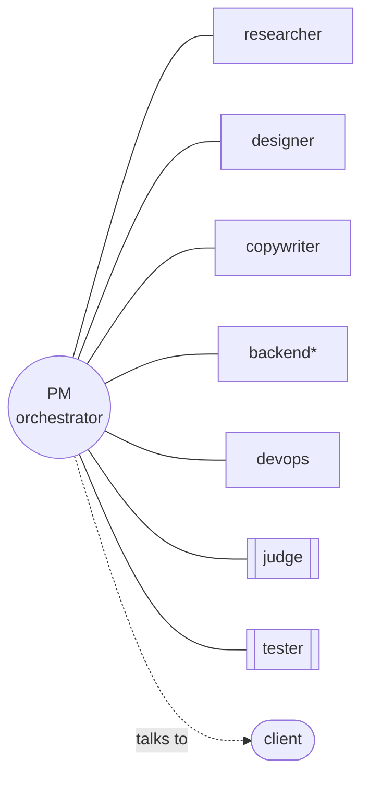
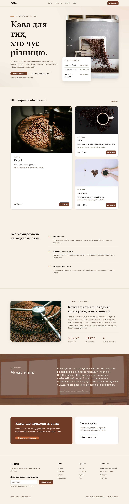

# 🎷 Jazz — an agent orchestra that builds websites

**Jazz is an agency-as-code.** A team of specialized [Claude Code](https://claude.com/claude-code)
subagents runs a client's web project end-to-end the way a real studio would — research, strategy,
design, copy, build, ship, QA — coordinated by a PM and communicating through Markdown files in a
shared workspace.

It's built to do the two things AI web tools usually get wrong:

1. **Produce sites that don't look AI-generated.** A chosen, defensible design direction plus a
   hard checklist of "AI tells" to avoid (Law 1).
2. **Make quality structural, not accidental.** Everything is a design token (Law 2) and nothing
   ships that isn't in the UI-kit (Law 3) — enforced by an adversarial Judge and validated by a
   browser-driving Tester.

## The orchestra



| | | |
|---|---|---|
| **pm** — plan, route, gates, client comms | **researcher** — market & competitors | **designer** — UX, art direction, tokens, UI-kit, build |
| **copywriter** — site copy | **backend** — APIs/DB *(if needed)* | **devops** — CI & deploy (Vercel) |
| **judge** — per-artifact critic | **tester** — end-to-end browser validation | |

The PM is the **single point of contact with the client** and the owner of the project's state.
See [docs/roles.md](docs/roles.md).

## How it works

The PM runs an 11-phase pipeline with two feedback loops — a **Judge loop** (per artifact, capped
at 3 revisions) and a **client loop** (at each ✅ gate, repeats until the client approves). Every
decision, client exchange, and review is written to files, so context never lives only in memory.

```
Intake → Research → Interview → Art direction → Content → Wireframes →
Design system (tokens + UI-kit) → Build → [Backend] → Deploy → E2E test → Handoff
```

Full diagram and gates: [docs/pipeline.md](docs/pipeline.md) · Why it's built this way:
[docs/methodology.md](docs/methodology.md).

## The three laws of quality

1. **Anti-AI design** — match a chosen design direction; avoid templated AI tells
   ([checklist](docs/anti-ai-checklist.md) · `.claude/skills/anti-ai-design`).
2. **Design tokens** — every color/font/space/shadow/radius is a W3C DTCG token → CSS variables;
   no hardcoded values (`.claude/skills/design-tokens`).
3. **Atomic + UI-kit** — build the kitchen-sink component page before any page; ship only what's
   declared (`.claude/skills/ui-kit`).

## Quick start

```bash
# 1) Use it as a project (recommended): open this repo in Claude Code.
#    The agents in .claude/agents and skills in .claude/skills load automatically.

# 2) Start a client project:
bash .claude/skills/new-project/scripts/scaffold.sh acme-coffee "Acme Coffee Roasters"

# 3) Tell Claude Code: "You are the Jazz PM. Read CLAUDE.md and start the acme-coffee project."
```

Default web stack for the sites it builds: **Next.js (App Router) + Tailwind + shadcn/ui**, fully
token-driven (`templates/next-starter/`).

### Install as a plugin (optional)
```text
/plugin marketplace add Maksym-nocorny/jazz
/plugin install jazz@jazz
```
> Manual, by-URL install only — Jazz is intentionally **not** listed in any public Claude plugin
> directory. To install the richer reused skills (design/engineering plugins), see
> [docs/INSTALL-SKILLS.md](docs/INSTALL-SKILLS.md).

## Repository layout

```
.claude/agents/      the 8 subagents
.claude/skills/      6 built-in skills + vendored wireframe skill
CLAUDE.md            the operating manual every agent reads
templates/           workspace templates + Next.js starter
docs/                methodology, pipeline, roles, install, credits
projects/            one folder per client (see projects/_example-coffee for a worked demo)
```

## A worked example
[`projects/_example-coffee/`](projects/_example-coffee/) is a full demo run for a fictional
Ukrainian specialty-coffee roaster (**ВОВК Coffee**) — research, copy, art direction, wireframes,
tokens, UI-kit, a built Next.js landing page with real curated photography, Judge reviews (incl. the
visual-quality gate), a visual-iteration record, and a Tester report. Living documentation of the
whole pipeline.

**Live demo → https://vovk-coffee.vercel.app**

[](https://vovk-coffee.vercel.app)

## Credits & license
Built on ideas from Anthropic's agent engineering, Brad Frost's Atomic Design, the W3C Design
Tokens format, and shadcn/ui. Vendored skills are attributed in [docs/CREDITS.md](docs/CREDITS.md).
MIT — see [LICENSE](LICENSE).
