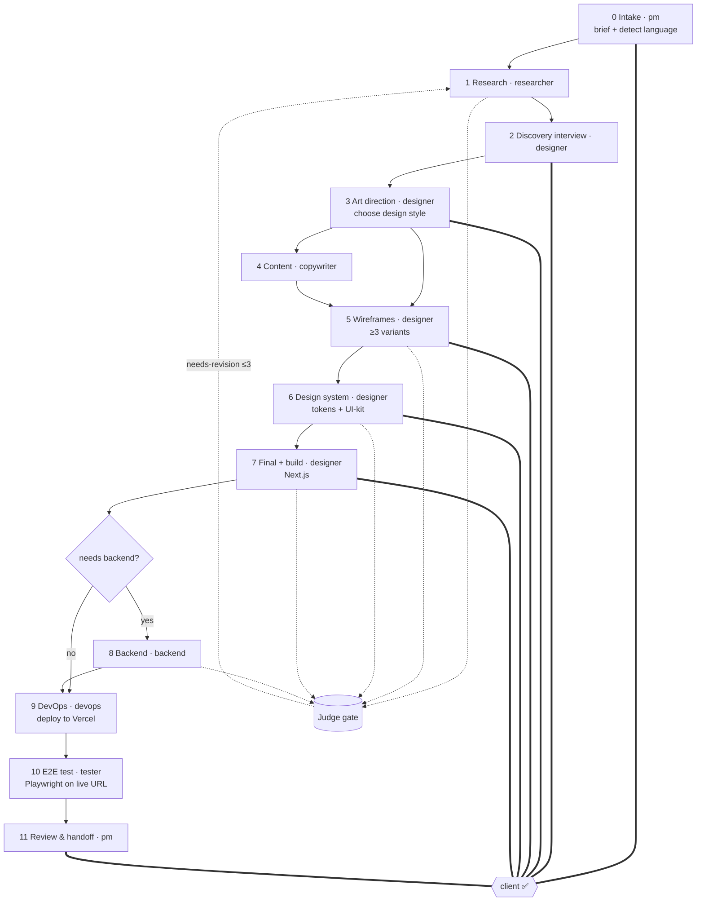

# Pipeline

The PM drives this pipeline. Two feedback loops run throughout: the **Judge loop** (per artifact,
bounded to 3 iterations) and the **client loop** (at ✅ gates, repeats until the client approves).

## Gates

| Phase | Judge gate | Client ✅ gate |
|---|---|---|
| 0 Intake | — | brief approved |
| 1 Research | yes | — |
| 2 Discovery interview | — | interview done |
| 3 Art direction | yes | direction chosen |
| 4 Content | yes | — |
| 5 Wireframes | yes | variant chosen + edits |
| 6 Design system | yes | scheme chosen + edits |
| 7 Final + build | yes | preview approved + edits |
| 8 Backend (conditional) | yes | — |
| 9 DevOps / deploy | yes | — |
| 10 E2E test | — (the tester *is* the gate) | — |
| 11 Review & handoff | — | acceptance |

## The two loops

- **Judge loop** — `specialist → judge → (revise → judge)×≤3 → approved`. On the 3rd failure the
  PM escalates to the client with options. Findings are machine-readable in `reviews/`.
- **Client loop** — `PM presents 2–3 options → client feedback/edits → log round in CLIENT_LOG →
  route to the right specialist → judge re-checks → PM re-presents → until approved`. Scope is
  fixed in `DECISIONS.md` to keep edits from sprawling.

See `.claude/skills/orchestration-protocol/SKILL.md` for the full procedure.
